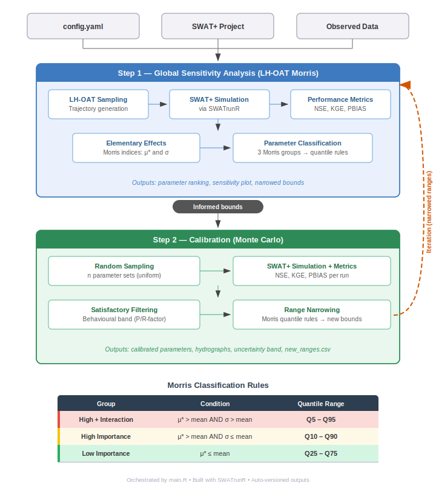

# SWAT+ Calibrator

[](https://doi.org/10.5281/zenodo.19793644)
[](LICENSE)

Single-phase sensitivity analysis, calibration and split-sample validation workflow for SWAT+ models using [SWATrunR](https://chrisschuerz.github.io/SWATrunR/).

**Workflow:** GSA (LH-OAT Morris screening) &rarr; Calibration (Monte Carlo sampling) &rarr; narrowed parameter ranges &rarr; optional re-iteration &rarr; optional split-sample validation on an independent period.

## Workflow



---

## Requirements


| Software   | Version  | Notes                                                                        |
|------------|----------|------------------------------------------------------------------------------|
| R          | >= 4.3.3                                 | Required for SWATrunR compatibility          |
| SWAT+      | >= swatplus-61.0.2.61-ifx-win_amd64-Rel  | Model executable must be inside project_path |
| RTools     | >= 4.3                                   | Windows only — needed to compile R packages  |


| Package     | Purpose                              |
|-------------|--------------------------------------|
| `SWATrunR`  | Run SWAT+ from R                     |
| `yaml`      | Read `config.yaml`                   |
| `dplyr`     | Data manipulation                    |
| `tibble`    | Tidy data frames                     |
| `tidyr`     | Pivot operations                     |
| `purrr`     | Functional iteration                 |
| `lhs`       | Latin Hypercube Sampling             |
| `hydroGOF`  | NSE, KGE, PBIAS                      |
| `lubridate` | Date handling                        |
| `ggplot2`   | Plots                                |
| `ggrepel`   | Non-overlapping labels in plots      |

Install all at once:

```r
install.packages(c(
  "yaml", "dplyr", "tibble", "tidyr", "purrr", "lhs",
  "hydroGOF", "lubridate", "ggplot2", "ggrepel", "remotes"
))

# ⚠️ SWATrunR 0.9.4 uses readr::read_table2() which was removed in readr 2.2.0.
# Pin readr to 2.1.2 BEFORE installing SWATrunR, otherwise install fails with
# "objeto 'read_table2' não foi exportado por 'namespace:readr'".
# (readr 1.4.0 also works but fails to compile on GCC 12 / RTools 43.)
remotes::install_version("readr", version = "2.1.2", upgrade = "never")

# SWATrunR (from GitHub)
remotes::install_github("chrisschuerz/SWATrunR", upgrade = "never")
```

> **Do not update `readr` afterwards.** SWATrunR bakes in a reference to
> `readr::read_table2()`, which was removed in readr 2.0.0. Upgrading readr
> will break SWATrunR at runtime. If you need to run `update.packages()`,
> exclude readr:
>
> ```r
> update.packages(ask = FALSE,
>                 oldPkgs = setdiff(installed.packages()[, "Package"], "readr"))
> ```

---

## Project structure

```
swatplus-calibrator/
├── config.yaml          # Single configuration file (edit this)
├── main.R               # Orchestrator: GSA → Calibration → (optional) Validation
├── run_gsa.R            # Step 1: LH-OAT Morris sensitivity analysis
├── run_cal.R            # Step 2: Monte Carlo calibration
├── run_val.R            # Step 3 (optional): Split-sample validation
└── R/
    ├── lhoat_engine.R   # LH-OAT trajectory generation + Elementary Effects
    ├── metrics.R        # NSE, KGE, PBIAS + behavioural band (P/R-factor)
    ├── morris_classify.R# Morris classification + quantile range narrowing
    ├── plots.R          # Publication-ready TIFF plots
    ├── run_filter.R     # Invalid run detection and filtering
    └── versioning.R     # Auto-versioned output folders
```

---

## Quick start

### 1. Prepare your SWAT+ project

Make sure your TxtInOut folder runs correctly with the SWAT+ executable. Place observed streamflow files inside the TxtInOut folder:

| File               | Format                                          |
|--------------------|-------------------------------------------------|
| `obs_flow_mon.csv` | Columns: `Date` (YYYY-MM-DD), `Flow` (m3/s)    |
| `obs_flow_daily.csv` | Columns: `Date` (YYYY-MM-DD), `Flow` (m3/s)  |

You only need the file matching your chosen `temporal_scale` (monthly or daily).

### 2. Edit `config.yaml`

Update at minimum:

```yaml
project_path: "C:/path/to/your/TxtInOut"
threads: 8                        # Number of parallel SWAT+ runs

simulation:
  start_date:   "1985-01-01"
  end_date:     "2010-12-31"
  warmup_years: 3

temporal_scale: "monthly"         # or "daily"

observed:
  monthly_file: "obs_flow_mon.csv"
  start_date:   "1988-01-01"      # First obs date after warm-up
```

Set the outlet channel unit in `gsa_outputs` and `cal_outputs`:

```yaml
gsa_outputs:
  streamflow:
    file:     "channel_sdmorph_mon"   # _day for daily
    variable: "flo_out"
    unit:     33                      # Your outlet channel ID
```

If using `temporal_scale: "daily"`, also update `gsa_metrics` suffixes:

```yaml
gsa_metrics:
  - "NSE_day"
  - "KGE_day"
  - "PBIAS_day"
  - "obj_total"
```

### 3. Run

From RStudio or VSCode (set working directory to `swatplus-calibrator/`):

```r
source("main.R")
```

From terminal:

```bash
Rscript main.R
# or
Rscript main.R path/to/config.yaml
```

You can also run steps individually:

```r
CONFIG_PATH <- "config.yaml"
source("run_gsa.R")   # Step 1 only
source("run_cal.R")   # Step 2 only (requires GSA_v* to exist)
source("run_val.R")   # Step 3 only (requires a calibrated parameter-set CSV)
```

---

## Workflow details

### Step 1: Global Sensitivity Analysis (`run_gsa.R`)

1. Generates **LH-OAT** (Latin Hypercube One-At-a-Time) trajectories in normalized [0,1] space
2. Scales to physical parameter bounds and runs SWAT+ via SWATrunR
3. Computes **NSE**, **KGE**, **PBIAS**, and **obj_total** for each run
4. Calculates **Elementary Effects (EE)** per trajectory step
5. Derives **Morris sensitivity indices**: &mu;\* (mean absolute EE) and &sigma; (standard deviation of EE)
6. Classifies parameters into three groups:

| Group                          | Condition                         | Quantile range |
|--------------------------------|-----------------------------------|----------------|
| High importance + interaction  | &mu;\* > mean **and** &sigma; > mean | Q5 &ndash; Q95 |
| High importance                | &mu;\* > mean **and** &sigma; &le; mean | Q10 &ndash; Q90 |
| Low importance                 | &mu;\* &le; mean                  | Q25 &ndash; Q75 |

**Output folder:** `GSA_v1/` (auto-increments on re-runs)

| File                            | Description                          |
|---------------------------------|--------------------------------------|
| `ranking_global_gsa.csv`        | Morris &mu;\* and &sigma; per parameter |
| `param_info_gsa.csv`            | Parameter bounds used in this run    |
| `metricas_gsa.csv`              | All metrics for all runs             |
| `ee_all_gsa.csv`                | Elementary Effects values            |
| `Morris_sensitivity_screening.tif` | Publication-ready scatter plot     |
| `resultado_gsa.rds`             | Full R object with all results       |

### Step 2: Calibration (`run_cal.R`)

1. Reads `param_info_gsa.csv` and `ranking_global_gsa.csv` from the latest `GSA_v*/` folder
2. **Excludes insensitive parameters** listed in `calibration.exclude_parameters` (fixed at their GSA median value)
3. Samples `n_simulations` random parameter sets (uniform within bounds)
4. Runs SWAT+ and computes NSE, KGE, PBIAS
5. Classifies runs as **satisfactory** if all thresholds are met simultaneously
6. Computes **water balance diagnostic** (ET/P and WYLD/P vs targets, if defined)
7. Builds the **behavioural band** (min&ndash;max envelope of satisfactory simulations at each timestep) and computes **P-factor** and **R-factor** (see below)
8. Computes **new narrowed parameter ranges** using the Morris group quantile rules applied to the satisfactory posterior distribution
9. Saves `new_ranges.csv` for the next iteration

**Output folder:** `CAL_v1/` (auto-increments on re-runs)

| File                       | Description                                   |
|----------------------------|-----------------------------------------------|
| `results_cal.csv`              | All runs with metrics + parameter values                       |
| `satisfactory_results.csv`     | Only satisfactory runs                                         |
| `new_ranges.csv`               | Narrowed parameter ranges for next iteration                   |
| `behavioural_band.csv`         | Band envelope per timestep (Date, lower, upper)                |
| `behavioural_band_factors.csv` | P-factor and R-factor values                                   |
| `balance_diagnostic.csv`       | Water balance diagnostic (ET/P, WYLD/P) per run                |
| `fdc_band.csv`                 | FDC envelope data (exceedance, obs_flow, lower, upper)         |
| `scatter_performance.tif`      | NSE vs KGE scatter plot with thresholds                        |
| `hydrograph.tif`               | Observed vs simulated streamflow with behavioural band         |
| `uncertainty_envelope.tif`     | Behavioural uncertainty band + observed (SWAT-CUP style)       |
| `fdc_envelope.tif`             | Flow Duration Curve with behavioural uncertainty band           |
| `boxplot_params.tif`           | Normalized satisfactory parameter distributions                |
| `resultado_cal.rds`            | Full R object with all results                                 |

---

## Iteration

After the first run, the console prints instructions for the next iteration. Update `config.yaml`:

```yaml
iteration:
  enabled:     true
  ranges_file: "C:/path/to/your/TxtInOut/CAL_vX/new_ranges.csv"
```

Then run again:

```r
source("main.R")
```

This creates `GSA_v2/` and `CAL_v2/` using the narrowed ranges from the previous calibration. The process can be repeated as many times as needed:

```
Iteration 1:  config.yaml (original bounds)  → GSA_v1/ → CAL_v1/new_ranges.csv
Iteration 2:  config.yaml (ranges from v1)   → GSA_v2/ → CAL_v2/new_ranges.csv
Iteration 3:  config.yaml (ranges from v2)   → GSA_v3/ → CAL_v3/new_ranges.csv
...
```

Parameters **not found** in `new_ranges.csv` keep their original YAML bounds. This lets you add new parameters between iterations.

---

## Split-sample validation (`run_val.R`)

After the calibration converges, the calibrated ensemble can be propagated through SWAT+ over an **independent period** that was not used in calibration (classical split-sample test; Klemes, 1986). The validation step does **not** narrow parameter ranges &mdash; it quantifies how the behavioural ensemble performs outside the calibration window.

### What it does

1. Reads a CSV with **one row per calibrated parameter set** (typically `CAL_vX/satisfactory_results.csv` or a robust/behavioural subset produced by downstream analysis).
2. Auto-detects parameter columns by the SWATrunR notation (`cn2::cn2.hru | change = pctchg`, etc.) &mdash; no manual column mapping needed.
3. Runs SWAT+ for the validation period using **exactly those parameter combinations** (no resampling).
4. Computes NSE/KGE/PBIAS on the validation window and flags runs that still meet the satisfactory thresholds (temporal-stability diagnostic).
5. Builds the behavioural band over the **full ensemble** (calibration-uncertainty propagation, GLUE/SUFI-2 convention) and, as a secondary diagnostic, over the subset of runs still satisfactory in validation.
6. Runs the water balance diagnostic (ET/P, WYLD/P) on the validation window when targets are defined.

### Configuration

Add a `validation:` block to `config.yaml`:

```yaml
validation:
  enabled:        true
  param_sets_csv: "C:/.../CAL_v1/satisfactory_results.csv"   # or a robust subset
  simulation:
    start_date:   "1986-01-01"      # earlier start allows proper warm-up
    end_date:     "1999-12-31"
    warmup_years: 4
  observed:
    start_date:   "1990-01-01"      # first date used for validation metrics
  # thresholds: {threshold_nse: 0.50, threshold_kge: 0.50, threshold_abs_pbias: 15.0}
  # targets:    {et_rto: 0.48147, wyld_rto: 0.51853}
  # outputs:    (same schema as cal_outputs)
```

All optional keys fall back to the top-level `simulation`, `observed`, `cal_outputs`, `calibration.threshold_*` and `calibration.targets` when omitted.

### Run

```r
source("main.R")    # Step 3 runs automatically when validation.enabled = true
```

Or stand-alone:

```r
CONFIG_PATH <- "config.yaml"
source("run_val.R")
```

```bash
Rscript run_val.R config.yaml
```

### Output folder: `VAL_v1/`

| File                                  | Description                                                                 |
|---------------------------------------|-----------------------------------------------------------------------------|
| `results_val.csv`                     | All valid runs: NSE/KGE/PBIAS + `still_satisfactory` flag + parameter values |
| `run_map.csv`                         | Mapping between SWATrunR run ids and the original calibration run ids       |
| `behavioural_band_full.csv`           | Min&ndash;max envelope from the full ensemble (per timestep)                |
| `behavioural_band_factors_full.csv`   | P-factor and R-factor of the full-ensemble band                             |
| `behavioural_band_stable.csv`         | Band restricted to runs still satisfactory in validation                    |
| `behavioural_band_factors_stable.csv` | P-factor and R-factor of the stable subset                                  |
| `balance_diagnostic_val.csv`          | ET/P and WYLD/P per run on the validation window                            |
| `fdc_band_val.csv`                    | FDC envelope (exceedance, observed, lower, upper)                           |
| `hydrograph_val.tif`                  | Validation hydrograph with band + still-satisfactory highlights             |
| `uncertainty_envelope_val.tif`        | SWAT-CUP&ndash;style band + observed for the validation window              |
| `fdc_envelope_val.tif`                | FDC with the full-ensemble band                                             |
| `scatter_performance_val.tif`         | NSE vs KGE scatter on the validation window                                 |
| `resultado_val.rds`                   | Full R object with all results, bands and the source CSV path               |

### Two uncertainty bands, two questions

- **Full-ensemble band** answers: *how much of the observed hydrograph does the calibrated uncertainty actually bracket out-of-sample?* This is the primary diagnostic for reporting.
- **Stable-subset band** answers: *of the calibrated runs, how many remain satisfactory on the validation period?* The ratio `n_stable / n_valid` is the temporal-stability rate &mdash; a direct test for non-stationarity in the calibrated behavioural region.

---

## Excluding insensitive parameters

Insensitive parameters identified by the Morris screening can be excluded from calibration to reduce the search space. Excluded parameters are **fixed at their median value** from the GSA posterior distribution &mdash; they are still passed to SWAT+ (so the model runs correctly) but are not sampled.

### Automatic exclusion (recommended)

Enable automatic exclusion based on the Morris &mu;\* index:

```yaml
calibration:
  auto_exclude: true              # Enable automatic exclusion
  auto_exclude_threshold: 0       # mu_star threshold
```

Parameters with &mu;\* &le; `auto_exclude_threshold` are automatically excluded. The default threshold `0` removes only **completely insensitive** parameters (those with zero effect on model output). Increase the threshold to be more aggressive:

| Threshold | Effect |
|-----------|--------|
| `0`       | Excludes only parameters with &mu;\* = 0 (no effect at all) |
| `0.05`    | Also excludes parameters with very low sensitivity |
| `0.10`    | More aggressive &mdash; keeps only clearly influential parameters |

Set `auto_exclude: false` to disable automatic exclusion entirely.

### Manual exclusion

You can also manually list parameters to exclude. This works independently of (and is additive with) automatic exclusion:

```yaml
calibration:
  exclude_parameters: ["canmx", "epco", "cn3_swf"]
```

Set `exclude_parameters: []` (empty list) if automatic exclusion is sufficient.

---

## Water balance diagnostic

If you define observed water balance targets in `config.yaml`, the calibration will compute ET/P and WYLD/P ratios for each run and report how satisfactory simulations compare to the targets:

```yaml
calibration:
  targets:
    et_rto:   0.48147    # observed ET / P ratio
    wyld_rto: 0.51853    # observed WYLD / P ratio
```

This requires adding the water balance outputs to `cal_outputs`:

```yaml
cal_outputs:
  streamflow:
    file: "channel_sdmorph_day"
    variable: "flo_out"
    unit: 33
  precip:
    file: "basin_wb_aa"
    variable: "precip"
    unit: 1
  et:
    file: "basin_wb_aa"
    variable: "et"
    unit: 1
  wateryld:
    file: "basin_wb_aa"
    variable: "wateryld"
    unit: 1
```

The diagnostic results are saved to `balance_diagnostic.csv` and included in `resultado_cal.rds`. This is a diagnostic check only &mdash; it does not filter runs, but helps verify that satisfactory streamflow simulations also maintain a realistic water balance.

---

## Performance metrics

| Metric    | Formula | Reference |
|-----------|---------|-----------|
| **NSE**   | 1 &minus; SS_res / SS_tot | Nash & Sutcliffe (1970) |
| **KGE**   | 1 &minus; &radic;((r&minus;1)&sup2; + (&beta;&minus;1)&sup2; + (&gamma;&minus;1)&sup2;) | Gupta et al. (2009) |
| **PBIAS** | 100 &times; &Sigma;(sim &minus; obs) / &Sigma;(obs) | Moriasi et al. (2007) |
| **obj_total** | (1 &minus; min(NSE,1)) + (1 &minus; min(KGE,1)) + \|PBIAS\|/100 | Combined error |

Default thresholds follow Moriasi et al. (2015) "satisfactory" criteria. Adjust in `config.yaml` to match your study requirements.

---

## Behavioural band and uncertainty indices

After calibration, the tool builds a **behavioural band** from all satisfactory simulations and computes two uncertainty indices inspired by SUFI-2 but applied to the behavioural (satisfactory) ensemble rather than a percentile-based prediction interval.

### Band construction

At each timestep *t*, the band boundaries are:

- **Lower** = min of all satisfactory simulations at *t*
- **Upper** = max of all satisfactory simulations at *t*

This is the full envelope of satisfactory runs, not a percentile subset.

### P-factor

Fraction of observed data points that fall inside the behavioural band:

> **P-factor** = *n* / *N*

where *n* = number of observed points within [lower, upper] and *N* = total observed points.

| Range | Interpretation |
|-------|----------------|
| > 0.70 | Satisfactory |
| > 0.80 | Good |
| &rarr; 1.0 | All observations bracketed |

### R-factor

Relative width of the behavioural band normalized by the variability of the observed data:

> **R-factor** = mean(upper &minus; lower) / &sigma;_obs

| Range | Interpretation |
|-------|----------------|
| < 1.50 | Satisfactory |
| < 1.00 | Good (narrow band) |
| &rarr; 0 | Perfect (but unlikely with P-factor &rarr; 1) |

P-factor and R-factor are inversely related: a wider band brackets more observations (higher P) but at the cost of a larger R. The goal is to maximize P-factor while keeping R-factor as low as possible.

### Hydrograph plot

The hydrograph (`hydrograph.tif`) shows all simulation runs with the behavioural band:

1. **Light blue shaded ribbon** &mdash; behavioural band (min&ndash;max envelope)
2. **Gray lines** &mdash; non-satisfactory simulations
3. **Blue lines** &mdash; satisfactory simulations
4. **Black line** &mdash; observed streamflow
5. **Annotation** (top-left) &mdash; P-factor and R-factor values

### Uncertainty envelope plot

The uncertainty envelope (`uncertainty_envelope.tif`) is a clean, SWAT-CUP&ndash;style plot that shows only the essential uncertainty information:

1. **Green shaded ribbon** &mdash; behavioural band (min&ndash;max envelope of all satisfactory simulations)
2. **Blue line** &mdash; observed streamflow
3. **Annotation** (top-left) &mdash; P-factor and R-factor values

Unlike the hydrograph, individual simulation lines are not shown. This provides a clear visualization of the prediction uncertainty range and how well it brackets observed data.

### Flow Duration Curve (FDC) with uncertainty band

The FDC envelope (`fdc_envelope.tif`) extends the behavioural band concept to the flow duration domain:

1. **Green shaded ribbon** &mdash; FDC envelope (min&ndash;max of sorted satisfactory simulations at each exceedance level)
2. **Blue line** &mdash; observed FDC

The x-axis shows exceedance probability (%) and the y-axis uses a logarithmic scale for streamflow. This diagnostic reveals whether the model reproduces the full range of flow regimes:

| FDC region | Exceedance | Flow regime |
|------------|------------|-------------|
| Left tail  | 0&ndash;10%   | High flows (flood peaks) |
| Middle     | 10&ndash;70%  | Medium flows |
| Right tail | 70&ndash;100% | Low flows (baseflow) |

If the observed FDC falls within the green band across all regions, the model captures both peak events and baseflow recession. Gaps indicate flow regimes where the model structure or parameterization needs improvement.

The FDC data is also saved as `fdc_band.csv` (columns: `exceedance`, `obs_flow`, `lower`, `upper`).

---

## Parameter notation (SWATrunR)

Parameters use SWATrunR notation: `variable::file | change = type`

| Change type | Meaning | Example |
|-------------|---------|---------|
| `pctchg`    | Percentage change from default | `cn2::cn2.hru \| change = pctchg` &rarr; CN2 &times; (1 + value/100) |
| `absval`    | Replace with absolute value | `esco::esco.hru \| change = absval` &rarr; ESCO = value |

---

## Tips

- **Start small:** Use `m_traj: 3` and `n_simulations: 30` for a test run to verify everything works before scaling up.
- **Check your outlet:** The `unit` field in `gsa_outputs` and `cal_outputs` must match the channel ID of your basin outlet in SWAT+.
- **Observed data alignment:** Make sure `observed.start_date` falls after the warm-up period (`simulation.start_date` + `warmup_years`).
- **Daily vs monthly:** Daily calibration is more demanding. Consider starting with monthly (`temporal_scale: "monthly"`) and relaxed thresholds, then switching to daily in a later iteration.
- **No satisfactory runs?** Increase `n_simulations`, relax thresholds, or check that the model structure is appropriate for your basin.
- **Output separation:** Set `output_path` to keep versioned folders outside TxtInOut if you prefer a cleaner project directory.

---

## Citation

If you use this software, please cite it via the metadata in [`CITATION.cff`](CITATION.cff). After a tagged release, a versioned DOI is automatically minted by Zenodo and shown as a badge at the top of this README.

GitHub natively renders `CITATION.cff` as a "Cite this repository" button on the repository landing page (top right), with ready-to-paste BibTeX/APA strings.

---

## Contact

For technical questions, bug reports, or feature requests, please open an issue on GitHub: <https://github.com/ECRIPPEL/swatplus-calibrator/issues>.

Author: Elzon Cassio Rippel — ORCID [0000-0002-8391-4435](https://orcid.org/0000-0002-8391-4435).

---

## License

Released under the MIT License — see [`LICENSE`](LICENSE) for the full text.

This tool depends on [SWAT+](https://swat.tamu.edu/software/plus/) and [SWATrunR](https://chrisschuerz.github.io/SWATrunR/), which are distributed under their own licenses.
